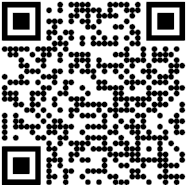

Aside
================================================================================

{width=65%}

Contact Info {#contact}
--------------------------------------------------------------------------------

- <i class="fa fa-envelope"></i>Faris.Alquaddoomi@tufts.edu
- <i class="fa fa-github"></i> [github.com/Farisalq/](https://github.com/Farisalq)
- <i class="fa fa-phone"></i> +1 626-354-4434

Technical Skills {#skills}
--------------------------------------------------------------------------------

**Software:** ArcGIS, GeoDa, PTC Creo, MATLAB, MS Office Suit, Python, C++, HTML , CSS, APSYS Crosslight

**Design:** Geometric Dimensioning & Tolerancing (GD&T), Rapid Prototyping, FDM 3D Printing, Laser Cutting

**Financial:** Financial Modeling, Data Analysis, Technical Analysis, Fundamental Analysis

Disclaimer {#disclaimer}
--------------------------------------------------------------------------------

<!--This resume was made with the R package [**pagedown**](https://github.com/rstudio/pagedown).-->

Last updated on `r Sys.Date()`.

Main
================================================================================

Faris Alquaddoomi {#title}
--------------------------------------------------------------------------------

### Data Analytics student seeking Summer 2021 internship

Education {data-icon=graduation-cap data-concise=true}
--------------------------------------------------------------------------------

### Tufts Gordon Institute

- Master of Science in Mechanical Engineering
- Master of Science in Innovation Management

Medford, MA

August 2020 -- May 2022

### University of Illinois at Urbana-Champaign

- Bachelor of Science in Mechanical Engineering
- Minor: Geographic Information Science

Urbana, IL

August 2015 -- May 2019

Selected Project Experience {data-icon=chalkboard-teacher}
--------------------------------------------------------------------------------

### Spectral Key	

<!--::: concise-->
- Partnered with Tufts REAP labs to develop an application for thermophotovoltaics (TPVs) in waste heat recovery. 
<!--:::-->

Somerville, MA

Spring 2021 -- Present

### Mobius Health	

<!--::: concise-->
- Developed a wearable technology company: Mobius Health.
<!--:::-->

Medford, MA

Fall 2020 -- Winter 2021

Work Experience {data-icon=comment-alt}
--------------------------------------------------------------------------------

### Tufts Technology Services (TTS)

<!--::: concise-->
- **Audio Visual Support Technician:** Providing on-site technical support for Tufts faculty and staff and ensuring that audio-visual equipment is functional to support remote-learning through Zoom and echo360
<!--:::-->

Medford, MA

August 2020 -- Present

### Administrative Information Technology Services (AITS)

<!--::: concise-->
- **Technical Service Representative:** Troubleshooting and systems applications assistance for clients over call (10/day average) and through the campus ticketing system
<!--:::-->

Champaign, IL

August 2018 -- May 2019

